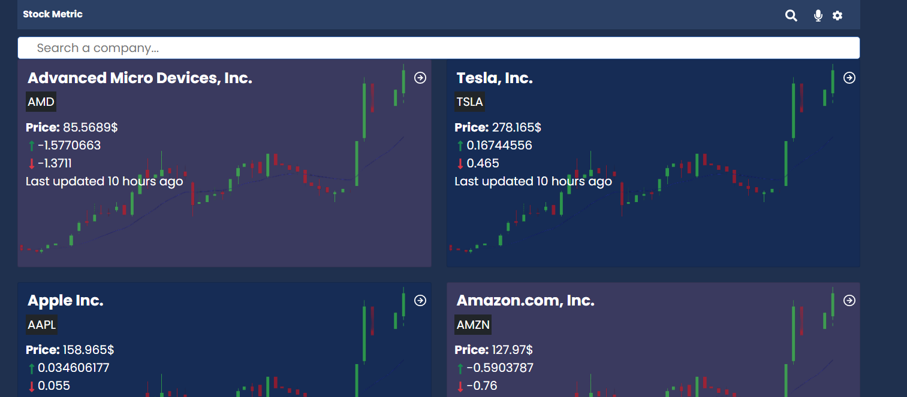
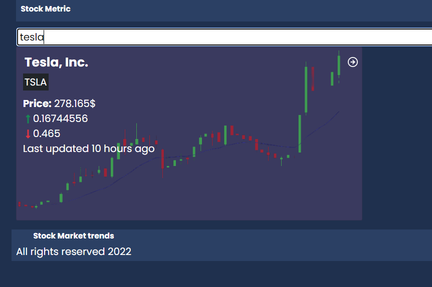

# Stock Metrics App





- [Live Demo](https://lizdev-stock-metric.netlify.app/)
- [Presentation Video](https://www.loom.com/share/6a04348b2dea48bd82a337493debb165)

>  Stock metrics is a web(mobile-focused) app for checking the companies listed on the stock exchange and see their live metrics. Its data is consumed from the [Financial modelling API](https://site.financialmodelingprep.com/developer/docs/). It is built using React, Redux, and React-bootsrap, Skeleton Loader, Recharts.


Additional description about the project and its features.

## Built With

- Major languages (HTML, CSS, JavaScript)

- Frameworks / Libraries
  ```bash
  - React (Front end library)
  - React Testing Library
  - Jest(for testing)
  - Git(version control)
  - ESLint(JavaScript linting)
  - Stylelint(style linting)
  ```

- Technologies used 
  
  ``` bash
  - Git(version control)
  ```


## Getting Started

To get a local copy up and running follow these simple example steps.

### Prerequisites
 - A text editor(preferably Visual Studio Code)

### Install
  -  [Git](https://git-scm.com/downloads)
  -  [Node](https://nodejs.org/en/download/)

### Usage
#### Clone this repository

```bash
$ git clone https://github.com/Lizdev-05/stock-market.git
$ cd Stock-metrics
```
#### Run project

```bash
$ npm install
$ npm build
$ npm run test
$ npm start
```

#### Open page in browser
```bash
$ runs on http://localhost:3001/
```

## Author

👤 **Ojesanmi Elizabeth Oyin**

- GitHub: [@githubhandle](https://github.com/Lizdev-05)

- LinkedIn: [LinkedIn](https://www.linkedin.com/in/elizabeth-oyinlade-ojesanmi-0702aa16a)

## 🤝 Contributing

Contributions, issues, and feature requests are welcome!

Feel free to check the [issues page]().

## Acknowledgement
Original design idea by [Nelson Sakwa on Behance..](https://www.behance.net/gallery/31579789/Ballhead-App-%28Free-PSDs%29) Under the [Creative Commons License](https://creativecommons.org/licenses/by-nc/4.0/)

## Show your support

Give a ⭐️ if you like this project!

## 📝 License

This project is [MIT](https://opensource.org/licenses/MIT) licensed.
